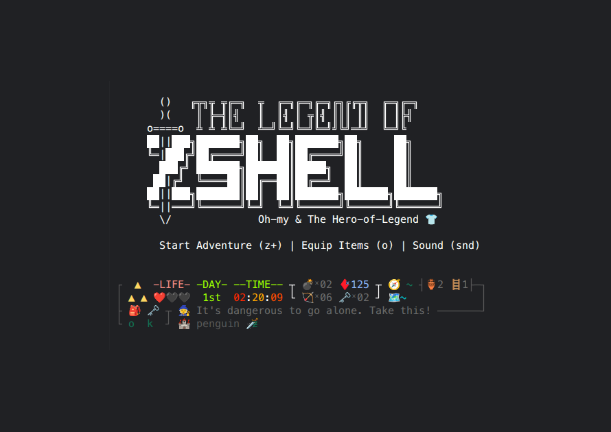

<div align="center">



<br/>

```
       ()   ╔╦╗╦ ╦╔═╗  ╦  ╔═╗╔═╗╔═╗╔╗╔╔╦╗  ╔═╗╔═╗
       )(    ║ ╠═╣║╣   ║  ║╣ ║ ╦║╣ ║║║ ║║  ║ ║╠╣
     o====o  ╩ ╩ ╩╚═╝  ╩═╝╚═╝╚═╝╚═╝╝╚╝═╩╝  ╚═╝╚
     ██||███╗███████╗██╗  ██╗███████╗██╗     ██╗
     ╚═|███╔╝██╔════╝██║  ██║██╔════╝██║     ██║
       ███╔╝ ███████╗███████║█████╗  ██║     ██║
      ██|╔╝  ╚════██║██╔══██║██╔══╝  ██║     ██║
     ██||███╗███████║██║  ██║███████╗███████╗███████╗
     ╚═||═══╝╚══════╝╚═╝  ╚═╝╚══════╝╚══════╝╚══════╝
       \/              Oh-My & The Hero of Legend 👕
```

# INSTRUCTION BOOKLET
### *SUPER OH-MY-ZSH ENTERTAINMENT SYSTEM*

[](https://www.zsh.org/)
[](https://ohmyz.sh/)
[](https://github.com/knerd/.oh-my-zsh-custom)
[](https://github.com/knerd/.oh-my-zsh-custom)
[](https://github.com/knerd/.oh-my-zsh-custom)
[](https://github.com/knerd/.oh-my-zsh-custom)
[](https://github.com/charmbracelet/gum)
[](https://reddit.com/r/unixporn)
[](https://github.com/knerd/.oh-my-zsh-custom)
[](https://github.com/knerd/.oh-my-zsh-custom/stargazers)
[](https://github.com/sponsors/knerd)

---


*WARNING: PLEASE READ THIS ENTIRE INSTRUCTION BOOKLET CAREFULLY BEFORE VENTURING INTO THE COMMAND LINE DUNGEON. KEEP THIS MANUAL CLOSE AT HAND FOR EMERGENCY SWORD TECHNIQUES, OCARINA SONGS, AND BOMB HANDLING.*

</div>

## 📜 TABLE OF CONTENTS

- [Arsenal & Screenshot Inventory](#-arsenal--screenshot-inventory)
- [A Message From the Creator (Why This Exists)](#-a-message-from-the-creator-20-years-of-glorious-overkill)
1. [The Legend of the Shell (Prologue)](#1-the-legend-of-the-shell-prologue)
2. [Controller Layout & Operations](#2-controller-layout--operations)
3. [The Heads-Up Display (HUD Anatomy)](#3-the-heads-up-display-hud-anatomy)
4. [The Armory: Master Sword, Shields & The Quiver](#4-the-armory-master-sword-shields--the-quiver)
5. [GitCuts: Swordsmanship of the Ancient Sages](#5-gitcuts-swordsmanship-of-the-ancient-sages)
6. [Magic Relics, Bombs & Ancient Tools](#6-magic-relics-bombs--ancient-tools)
7. [The 3-Day Majora's Cycle & The Song of Time](#7-the-3-day-majoras-cycle--the-song-of-time)
8. [The Battle System: Spells, Rupee Economy & Villains](#8-the-battle-system-spells-rupee-economy--villains)
9. [Companions of Hyrule ("Hey, Listen!")](#9-companions-of-hyrule-hey-listen)
10. [Beginning Your Quest (Installation & Quickstart)](#10-beginning-your-quest-installation--quickstart)
11. [The Configuration Scrolls (Customization & Options)](#11-the-configuration-scrolls-customization--options)
12. [Reddit Traveler's Field Guide](#12-reddit-travelers-field-guide)
13. [Honorable Mentions & Hall of Legends](#13-honorable-mentions--hall-of-legends)
14. [Support the Realm](#14-support-the-realm)

---

## 💌 A MESSAGE FROM THE CREATOR: 20 YEARS OF GLORIOUS OVERKILL

> *"Most CLI users strive for a clean, minimalist terminal. I wanted to gamify my entire command-line existence."*

This theme started out of pure boredom over **20 years ago**. What began as a tiny scratchpad of ideas gradually turned into an obsession. Over the years I just kept adding concepts, mechanics, and expanding upon it. 

Most terminal users want a lean, simple, distraction-free prompt. I took the exact opposite path: I wanted to **gamify my CLI experience**. I went completely, unapologetically overboard and built this glorious overkill. 

After using it day in and day out for over two decades, I’ve grown to love it so much that I literally cannot work in any other shell environment. With the recent help of AI, I finally sat down, refactored and cleaned up the codebase, squashed decades of edge-case bugs, and got everything to a place where I finally feel good enough about it to share it with the world.

Even if no one else uses it, and yes, I know it is the complete and utter opposite of a lean terminal, but that's not the point! 

I wanted something that was fun and consistently feeds me dopamine. My inspiration originally came from the classic **Zelda NES / SNES HUD**, where you had the **A** and **B** buttons for your equipped items. I wanted single-letter button clicks for my daily Git commands (`A` for add, `B` for branch, `C` for commit, `P` for push), and that simple dream extended into all of these other Zelda-inspired tools, sounds, and mini-games. 

I honestly love the **Light Arrows (`a+`)**—it makes zipping around my computer stupid fast and genuinely fun. 

Also cleaning up my downloads folder has never been funner. a! FTW

Enjoy the quest! 🗡️✨

---

## 1. THE LEGEND OF THE SHELL (PROLOGUE)

```
                       ▲
                      ▲ ▲
            THE SACRED TRIFORCE OF UNIX
```

A long time ago, in the kingdom of the Terminal Realm, three Golden Goddesses bestowed the Sacred Shell upon humanity: **Wisdom** (Zsh configuration), **Power** (sub-millisecond prompt speed), and **Courage** (running `rm -rf` without hesitation). 

For generations, peace reigned. But then, a creeping darkness swallowed the command line: bloated startup scripts that took 4 seconds to spawn, broken PATH variables, forgotten downloads folders piling up like refuse in Lake Hylia, and terrifying uncommitted Git repositories that wandered the filesystem like corrupted Moblins.

The ancient prophecy told of a Hero clad in the green tunic (`hero-of-legend.zsh-theme`) who would rise from Kokiri Forest. Armed with the **Master Sword** (`z`), protected by the **Magic Shield** (`s`), and accompanied by the fairy **Navi**, the Hero shall bring balance back to standard input and standard output.

> *"He who masters the single-key shortcuts shall claim the Triforce of Productivity."*  
> — *The Book of Mudora, Chapter IV*

---

## 2. CONTROLLER LAYOUT & OPERATIONS

Before venturing forth, familiarize yourself with the buttons on your command deck. Every weapon and item is mapped to rapid-action keystrokes:

```
                  ___________________________________________
                 / [L] Magic Lantern        [R] Blue Ring    \
                /      (ls -la)              (Reload zshrc)   \
               |                                               |
               |      ▲  k (Climb Floor)               (X)     |
               |   ◄  ..  ► cd                   (Y)         (A)|
               |      ▼  a (Downloads)                 (B)     |
               |                                               |
               |             SELECT         START              |
               |           [? Boots]       [z Sword]           |
                \                                             /
                 \___________________________________________/
```

### 🎮 The Gamepad Mapping Matrix

| Button / Key | Item / Weapon | Shell Spell | Hero's Action |
| :---: | :--- | :--- | :--- |
| **START** | **Master Sword** (`z`) | `CL; hud` | Clears clutter, displays the golden HUD, and readies your blade. |
| **SELECT** | **Pegasus Boots** (`?`) | Quick Help Menu | Dashes through the full shortcut index using `less`. |
| **(Y)** | **Magic Backpack** (`o`) | `HeroInventory open` | Opens your 16-bit interactive inventory chest with Song of Storms! |
| **(B)** | **Magic Bombs** (`b`) | `hero-magic-bomb` | Detonates the trash bin or dispatches files into oblivion. |
| **(A)** | **Fire Arrow** (`a!`) | `hero-fire-arrows` | Archery mini-game! Annihilates unwanted downloads & earns **Rupees** for sharpshooting. |
| **(X)** | **Quake Spell** (`x`) | `exit` | Casts terminal earthquake and bids Hyrule farewell. |
| **D-PAD ▲** | **Small Key** (`k`) | `hero-magic-key` | Turns the key to ascend 1 to 9 directory floors (`k2`, `k3`... `k9`). |
| **D-PAD ▼** | **Magic Bow** (`a` / `arw`) | `cd ~/Downloads` | Looses an arrow straight to `~/Downloads` and surveys targets. |
| **D-PAD ◄** | **Backtrack** (`..`, `...`) | `cd ..` | Steps backward through dungeon corridors safely. |
| **D-PAD ►** | **Magic Feather** (`j`) | `z` (`zoxide`) | Leaps across the kingdom directly to your destination. |
| **[L] TRIGGER** | **Magic Lantern** (`L`) | `ls -la` | Illuminates all hidden and forbidden dotfiles in the shadows. |
| **[R] TRIGGER** | **Blue Ring** (`R`) | `source ~/.zshrc` | Wards off bugs and refreshes your shell's magical essence. |
| **START+** | **Magic Chest** (`z+`) | `hero-magic-chest` | Teleports and installs/updates Hero tools from the clouds. |

---

## 3. THE HEADS-UP DISPLAY (HUD ANATOMY)

Your prompt is an authentic, dual-tier Classic Zelda NES Heads-Up Display rendered with pixel-perfect box borders and dynamic gradient colors:

```
┌ ▲ -LIFE- -DAY- --TIME-- ┬ 💣ˣ00 ♦️ˣ050 ┬ 🧭 master ↑1 ┤🏺12 🪜3├──────┐
│ ▲ ▲ ❤️❤️❤️  1st  08:12:44 └ 🏹ˣ04 🗝️ˣ02 ┘ 🗺️ ~/code/hero-quest           │
├ 🎒o 🏹a! ❄️a- ⚡a+ ┬ 🧚 Navi: "Hey! Look at all those unstaged files!" ─┘
└ o a! a- a+ ┘ 🏰 knerd/oh-my-zsh-custom 🗡️ƶ 
```

### 1. The Sacred Triforce
* **Outside Git Dungeons (The Castle 🏰):** An upright golden Triforce (`▲ / ▲ ▲`).
* **Inside Git Dungeons (The Catacombs 💀):** The Triforce inverts (`⯆ ⯆ / ⯆`), signaling you have entered ancient version-control chambers.

### 2. Life Gauge (`-LIFE-`)
Your hearts reflect the hygiene of your Git realm:
* **`❤️❤️❤️` (3 Full Hearts):** Clean working tree. Your code is committed, pristine, and invincible.
* **`❤️❤️🖤` (2 Hearts):** Working tree is **DIRTY**! You have uncommitted modifications. Tread carefully!
* **`❤️🖤🖤` (1 Heart):** Unprotected wilderness outside of any Git repository.

### 3. Majora's 3-Day Countdown (`-DAY-` & `--TIME--`)
* Displays your current survival day (`1st`, `2nd`, `3rd`).
* Real-time ticking 24-hour clock dynamically shifts from **emerald green** $\rightarrow$ **dungeon yellow** $\rightarrow$ **blood red** as midnight approaches!
* Beware the 4th Day: if the timer expires, the Moon crashes onto Clock Town! Play the **Song of Time** (`st`) to reset back to the Dawn of the First Day.

### 4. Consumables & Counters
* **`💣 Bombs`**: Tracks gigabytes or items lingering in your OS Trash. (Turns into red dynamite `🧨` if trash exceeds 20 items!)
* **`♦️ Rupees`**: Your active fortune. Earn **+5 Rupees** for every victorious command and rich rewards in the **Fire Arrow Archery Range** (`a!`). But beware: syntax errors let Ganon's minions steal **-10 Rupees**!
* **`🏹 Arrows`**: The number of pending files awaiting your bow in `~/Downloads`.
* **`🗝️ Keys`**: Number of available upward directory locks.

### 5. The Compass (🧭) & Dungeon Map (🗺️)
* **The Compass**: Shows your current Git branch, upstream synchronization (ahead `↑` and behind `↓` counts), plus room contents:
  * `🏺 Pots`: Files in the current directory room.
  * `🪜 Ladders`: Subdirectories leading deeper.
* **The Map**: Displays your current realm coordinates (`%~`). Shows a padlock `🔒` if write permissions are sealed!

### 6. Action Slots & Companion Scroll
* **Equipped Action Slots**: 4 quick-cast item slots with their trigger buttons.
* **Companion Dialogue**: Context-aware advice from Navi 🧚, King of Red Lions 🦁, the Old Wizard 🧙‍♂️, Princess Zelda 👑, or the Happy Mask Salesman 🎭.

---

## 4. THE ARMORY: MASTER SWORD, SHIELDS & THE QUIVER

```
        /| _____________________________________________________
 O|===|* >_____________________________________________________>
        \|
```

### 🗡️ The Master Sword (`z`)
The legendary blade that banishes clutter from your screen. Invoking `z` executes a clean wipe and summons the 16-bit HUD right before your eyes.

### 🛡️ The Magic Shield (`s`)
Deflects corrupted memory! Runs `omz reload` to restore all aliases, functions, and prompt hooks without restarting your terminal emulator.

### 🏹 The Elemental Quivers
Your quiver is stocked with three enchanted arrow types:

```
>>-------->🔥  FIRE ARROW   (`a!`)
>>-------->❄️  ICE ARROW    (`a-`)
>>-------->⚡  LIGHT ARROW  (`a+`)
```

#### 🔥 Fire Arrows (`a!`) — *The Archery Mini-Game & Rupee Range*
Do not let your `~/Downloads` directory become an overgrown swamp. Run `a!` to enter the 16-bit shooting range powered by Charmbracelet `gum`:
1. Use `UP` / `DOWN` and `SPACE` to mark target files, then confirm with `ENTER`.
2. **Time Your Shot**: A flying fire arrow streaks across the range (`>>----->🔥`). Press `SPACE` precisely as the arrowhead hits the target document (`📄`)!
3. **Earn Rupee Rewards**: Your timing determines your accuracy, damage tier, score, and Rupee rewards deposited directly into your persistent wallet:
   * 🎯 **BULLSEYE!** (Gap $\le 1$): `+500 pts` | **+20 Rupees** (`♦️`)
   * 💥 **CRITICAL!** (Gap $\le 4$): `+300 pts` | **+10 Rupees** (`♦️`)
   * 🏹 **Hit** (Gap $\le 10$): `+100 pts` | **+5 Rupees** (`♦️`)
   * 🤕 **Glancing Blow**: `+50 pts` | **+1 Rupee** (`♦️`)
   * 🐢 **Too Slow / Miss**: `0 pts` | **0 Rupees**
4. **Archery Rank Bonus**: Clear your selected batch to claim a session rank bonus:
   * 🏹 **LEGENDARY ARCHER**: **+200 Bonus Rupees**
   * 🎯 **SHARPSHOOTER**: **+100 Bonus Rupees**
   * 🏹 **ARCHER**: **+50 Bonus Rupees**
   * 👶 **NOVICE BOWMAN**: **+20 Bonus Rupees**
5. Files are permanently purged, your wallet balance updates live in the HUD prompt, and your high score is inscribed into the Hall of Fame!

#### ❄️ Ice Arrows (`a-`) — *Glacial Git Stash*
Freeze your uncommitted changes in crystal ice!
* Run `a-` to freeze your dirty working tree into a git stash.
* Thaw, inspect, or shatter frozen stashes with a visual menu.

#### ⚡ Light Arrows (`a+`) — *Warp Point Teleportation*
Create instant warp beacons anywhere in the filesystem!
* Shoot an arrow: `source hero-light-arrow` (or `a+`).
* Give it a name (e.g., `a.project`, `a.docs`).
* Now, typing `a.project` instantly plays the warp chime, displays an arrow flight animation, and teleports you directly to the target sanctuary!

---

## 5. GITCUTS: SWORDSMANSHIP OF THE ANCIENT SAGES

Tired of typing lengthy Git incantations? Master the single-letter blade techniques etched into the temple walls:

| Key | Icon | Weapon | Git Spell Invocation | Description |
| :---: | :---: | :--- | :--- | :--- |
| **`A`** | 🔨 | **Magic Hammer** | `git add` | Pound changes into the staging area! |
| **`B`** | 🌱 | **Magic Bean** | `git checkout -b` | Plant a new branch and watch it sprout! |
| **`C`** | 📜 | **Magic Scroll** | `git commit -m` | Inscribe your changes into version history. |
| **`CO`** | 🪝 | **Hookshot** | `git checkout` | Grapple onto any commit, branch, or tag! |
| **`D`** | 🪞 | **Magic Mirror** | `git diff` | Gaze into the mirror to reveal modified lines. |
| **`M`** | 🍾 | **Magic Bottle** | `git merge` | Capture another branch and merge timelines. |
| **`P`** | 🪃 | **Magic Boomerang** | `git push` | Fling commits to the remote (they always return). |
| **`p`** | 🧲 | **Magnetic Glove** | `git pull` | Attract remote commits into your worktree. |
| **`S`** | 🍄 | **Magic Mushroom** | `git status` | Reveal the current health and state of your repo. |

### 🌀 Git Flow Techniques
For advanced crusades, wield the Sacred Flow spells:
* `g` : `git flow`
* `g-` : `git flow init`
* `g+` / `g+s` / `g+f` : Feature branches (start, finish, publish)
* `g!` / `g!s` / `g!f` : Hotfix emergencies
* `g?` / `g?s` / `g?f` : Bugfix skirmishes
* `g.` / `g.s` / `g.f` : Official Releases

---

## 6. MAGIC RELICS, BOMBS & ANCIENT TOOLS

| 💣 | 🗝️ | 🖍️ | 🏮 | 📘 | 🔮 |
| :---: | :---: | :---: | :---: | :---: | :---: |
| **Bombs** | **Keys** | **Marker** | **Lantern** | **Spellbook** | **Crystal Ball** |
| Trash Detonator | Floor Climber | Snippet Quill | Shadow Illuminator | Command History | Process Scryer |

### 💣 Magic Bombs (`b`, `b+`, `b-`, `b!`)
* **`b`**: Detonates the trash bin! Counts down `💣 3.. 2.. 1.. 💥 BOOM!` and wipes OS trash safely.
* **`b+ <file>`**: Safely tosses an unwanted file into the bomb bag (trash folder) without hazardous `rm` deletion.
* **`b-`**: Peeks inside the bomb bag to see what files are waiting.
* **`b!`**: Force-detonate without confirmation dialogs.

### 🗝️ Small Keys (`k`, `k2` – `k9`)
Never type `cd ../../../..` again. Use the magic keys:
* `k` : Ascends 1 floor (`cd ..`).
* `k2` : Ascends 2 floors (`cd ../..`).
* `k5` : Ascends 5 floors straight to the castle ramparts!

### 🖍️ Magic Marker (`m`, `mark`)
Scribble code snippets, reminders, or cheat codes on the fly.
* `m "docker run -p 8080:80 nginx"` : Inscribes snippet into `~/hero-magic-crayon`.
* `m-` : Erases the last inscribed rune.

### 🏮 Magic Lantern (`L`) & Lens of Truth (`f`)
* `L` : Casts light into the dungeon (`ls -la`), revealing all hidden dotfiles.
* `f <pattern>` : Peeks through walls using `find . | grep <pattern>`.

### 📘 Book of Spells (`h`)
* `h <query>` : Searches the ancient archives of your CLI command history (`history | grep <query>`).

### 🥊 Power Gloves (`G`)
* Executes heavy lifting chores! Nukes bulky `node_modules` and `vendor` directories, then runs your package manager fresh.

### 🎺 Magic Trumpet (`lt`)
* Plays a high brass fanfare that opens a public gateway to localhost using LocalTunnel (`lt -h http://localtunnel.me`).

### 🔤 Magic Quill (`fn`)
* Automatically fetches and configures the ancient MesloLGS Nerd Font runes for your terminal emulator.

---

## 7. THE 3-DAY MAJORA'S CYCLE & THE SONG OF TIME

```
                     .---.
                    /     \
                   | () () |
                    \  ^  /   "You've met with a terrible fate,
                     '---'     haven't you?"
```

Time in the terminal is fleeting. The Hero of Legend Theme incorporates the complete temporal engine of *Majora's Mask*:

1. **Dawn of the First Day (72 Hours Remain)**: The prompt header shines in a calm, radiant green.
2. **Dawn of the Second Day (48 Hours Remain)**: The timer turns yellow; shadows lengthen across your editor.
3. **Dawn of the Final Day (24 Hours Remain)**: The countdown blazes in crimson red! The ground shakes underfoot!
4. **The Moon Crash**: If 3 days elapse without a time reset, the Moon crashes onto your shell session! A grim warning is inscribed upon your screen:
   ```
   🌑 The Moon has crashed. You've met with a terrible fate, haven't you?
   Play the Song of Time (st) to return to the Dawn of the First Day.
   ```

### 🎼 The Song of Time (`st`)
Whenever time runs low, pull out the Ocarina of Time by running:
```bash
st
```
The shell will synthesize the 8-bit Song of Time chiptune through your audio card, reset the temporal files, and restore you to:
> *"Green skies open. You have returned to the Dawn of the First Day."*

---

## 8. THE BATTLE SYSTEM: SPELLS, RUPEE ECONOMY & VILLAINS

In Hyrule, every shell command is cast as a spell:

### 🌟 Victorious Invocations
When a command exits with code `0`, your magic flourishes and you are rewarded with **+5 Rupees** (`♦️`) deposited into your persistent wallet (`~/.hero_wallet`).

### 🎯 Archery Range Winnings (`a!`)
Need to replenish your fortune after Ganon's minions raid your wallet? Run the Archery Mini-Game (`a!` or `hero-fire-arrows`):
* **Shot Accuracy Rewards**: Earn **+1 to +20 Rupees** per target based on timing precision (Bullseyes pay **+20 Rupees**!).
* **Rank Bonus**: Clear your batch to earn up to **+200 Bonus Rupees** for achieving Legendary Archer rank in a single session.
* All winnings are deposited immediately into your persistent wallet and reflected on your HUD.

### ⚔️ Failed Spells & The Villain's Ambush
If a command fails (exit code $\neq 0$), an enemy ambushes you!
1. A system notification alerts: `MISS! Villain stole 10 Rupees!`.
2. Ganon's minions seize **10 Rupees** from your bag.
3. A retro Battle Box is rendered directly above your next prompt:

```
┌─ ⚔️ BATTLE LOG ──────────────────────────────────────┐
│ xopher casts git psh origin master...                │
│ ➤ It had no effect!                                  │
│ 👾 "Mwuahaha!" (10 ♦️ were stolen!)                   │
│ ➤ Navi: "Did you spell your command right, Hero?"    │
└──────────────────────────────────────────────────────┘
```

Train your keystrokes, avoid reckless typos, and amass a fortune of 999 Rupees!

---

## 9. COMPANIONS OF HYRULE ("HEY, LISTEN!")

Your quest is dangerous, but you need not walk alone. The theme features a living cast of Hyrule companions who offer wisdom, shortcut tips, and context-aware alerts right above your prompt line:

### 🎭 Resident Companions & Authentic In-Game Quotes

| Icon | Companion | Key | Actual Theme Quotes |
| :---: | :--- | :---: | :--- |
| 🧙 | **Old Wizard** | `wizard` | • *"It's dangerous to go alone. Take this!"*<br/>• *"Master the Master Sword, and the world is yours."*<br/>• *"Time passes, people move.... Like a river's flow, it never ends."*<br/>• *"A hero's journey is never truly finished."*<br/>• *"Everything has its own pace. Just follow your own."* |
| 🧚 | **Fairy (Navi)** | `fairy` | • *"There is a hidden secret nearby!"*<br/>• *"Hey, look!"*<br/>• *"Hey! Use 'L' to light up your directory with the Magic Lantern!"*<br/>• *"The Lantern (f) can find anything hidden in the dark!"*<br/>• *"Hey! The Boomerang (P) is great for returning your changes to the remote!"* |
| 👸 | **The King** | `king` | • *"He who wields the Master Sword shall be the Hero of Time."*<br/>• *"The Great Sea is vast. You will need a boat."*<br/>• *"Well excuse me, princess!"*<br/>• *"The 3-day cycle is real! Reset the time with the Ocarina (st)."* |
| 🧝‍♀️ | **Princess Zelda** | `queen` | • *"Take this with you! It's one of my most precious possessions."*<br/>• *"Take this bottle. It will be useful."*<br/>• *"Your Rupees (♦️) grow with every successful command. Don't let the villains take them!"*<br/>• *"Keep an eye on the time. The 4th day brings the Moon Crash!"* |
| 🧝🏻 | **Secret Elf** | `elf` | • *"Zshhhhh, It's a secret to everybody. (z+)"*<br/>• *"Use your magic key! (k[2-9])"*<br/>• *"Use this trumpet (lt) to open magic portals!"*<br/>• *"The Magic Book (h) is powerful. Use 'h search_term' to find old spells."*<br/>• *"Small keys (k2, k3...) help you ascend through the directory levels."* |
| 🎭 | **Mask Salesman** | `mask` | • *"You've met with a terrible fate, haven't you?"*<br/>• *"Believe in your strengths... believe..."*<br/>• *"Masks (aliases) can change how you interact with the world."* |
| 🦹 | **Villain / Error** | `villain` | • *"I am Error."*<br/>• *"GRUMBLE, GRUMBLE..."* |
| 🐳 | **Wind Fish** | `whale` | • *"Shadow and Light are two sides of the same coin."* |

### 🧠 Context-Sensitive Triggers ("Smart Companion Advisor")

Companions don't just speak at random—they actively monitor your terminal environment in real-time:
* **Unpushed Commits (5+)**: 🧚 *"Whoa! X unpushed commits! Use 'P'!"*
* **Uncommitted Changes (Dirty)**: 🧚 *"Uncommitted changes! Use 'C' to commit."*
* **Low Disk Space (>90% full)**: 🐲 *"DANGER! Disk space is running low! (X% full)"*
* **Missing Node Modules**: 🧚 *"I see a package.json but no node_modules. Run 'npm install'?"*
* **Rust Repositories**: 🦸 *"A Rust project! Be safe out there."*
* **Python Outside Virtualenv**: 🧙 *"You are not in a virtual environment. dangerous magic surrounds you."*
* **Safe Deletion Tips**: Run `rm` $\rightarrow$ 🧚 *"Use b+ instead of rm to safely add files to your bomb bag (trash)."*
* **Climbing Floors**: Run `cd ..` $\rightarrow$ 🧝🏻 *"Use your magic key! (k[2-9])"*

* **Toggle Companions**: Run `n` to toggle Navi and companion messages on or off at any time.
* **Manual Invocation**: Export `HEY_LISTEN="Your custom message"` or `HOL_NPC=wizard` to summon a dialogue directly from any sage!

---

## 10. BEGINNING YOUR QUEST (INSTALLATION & QUICKSTART)

### 🗡️ Step 1: Requirements
Ensure you have the following treasures in your satchel:
* **Zsh** (v5.0 or newer)
* **Oh My Zsh** installed (`~/.oh-my-zsh`)
* **Python 3** (Used for mathematical 8-bit audio waveform synthesis — no bulky MP3 files needed!)
* **Charm Gum** (Optional, but highly recommended for 16-bit interactive menus):
  ```bash
  # macOS
  brew install gum
  # Debian / Ubuntu
  sudo mkdir -p /etc/apt/keyrings
  curl -fsSL https://repo.charm.sh/apt/gpg.key | sudo gpg --dearmor -o /etc/apt/keyrings/charm.gpg
  echo "deb [signed-by=/etc/apt/keyrings/charm.gpg] https://repo.charm.sh/apt/ * *" | sudo tee /etc/apt/sources.list.d/charm.list
  sudo apt update && sudo apt install gum
  # Arch Linux
  pacman -S gum
  ```

### 🛡️ Step 2: Clone into Oh-My-Zsh Custom
Summon this repository into your custom Oh-My-Zsh realm:

```bash
git clone --recurse-submodules https://github.com/knerd/.oh-my-zsh-custom.git ${ZSH_CUSTOM:-$HOME/.oh-my-zsh/custom}
```

*If you already cloned without submodules, initialize the weapon bin:*
```bash
cd ${ZSH_CUSTOM:-$HOME/.oh-my-zsh/custom}
git submodule update --init --recursive
```

### 🥻 Step 3: Don the Hero's Tunic
Open your `~/.zshrc` file:
```bash
nano ~/.zshrc
```
Set the legendary theme:
```bash
ZSH_THEME="hero-of-legend"
```

Save and equip your new tunic:
```bash
source ~/.zshrc
```
You will be greeted by the golden Triforce splash screen and the ancient Ocarina chime! 🎺

---

## 11. THE CONFIGURATION SCROLLS (CUSTOMIZATION & OPTIONS)

Tailor the realm to match your specific terminal screen:

### 🫀 Heart & Emoji Alignment Toggle (`hpad`)
Different terminal emulators handle Unicode emoji widths differently (Linux glibc vs macOS/WezTerm/iTerm2). If hearts overlap or text is misaligned:
```bash
hpad        # Toggles between Linux/glibc padding and modern Unicode 9+ mode
```

### 🔊 Audio Chime Controls (`snd` / `sound`)
Toggle the 8-bit audio synthesizers on startup and menu operations:
```bash
snd         # Toggles Zelda startup chime ON or OFF
```

Set custom volume (1-100) in your `~/.zshrc`:
```bash
export HERO_VOLUME=25
```

### ⏱️ Real-Time Tick Rate
By default, the 24-hour clock ticks every second with zero subprocess overhead using Zsh native `TRAPALRM`. If running over high-latency SSH connections, you can disable the 1-second pulse:
```bash
export HERO_ENABLE_TICK=0
```

### 🎒 The Interactive Backpack (`o`)
Press `o` to open the interactive inventory screen. Equip your favorite 4 items to appear directly on your HUD action bar:
| Slot | Icon | Equipped Item | Action / Invocation |
| :---: | :---: | :--- | :--- |
| **[1]** | 🗡️ | **Magic Sword** | `clear` (Banishes clutter & summons HUD) |
| **[2]** | 🔥 | **Fire Arrow** | `hero-fire-arrows` (Downloads archery mini-game) |
| **[3]** | ❄️ | **Ice Arrow** | `hero-ice-arrow` (Glacial git stash freeze/thaw) |
| **[4]** | ⚡ | **Light Arrow** | `source hero-light-arrow` (Warp point beacon) |

---

## 12. REDDIT TRAVELER'S FIELD GUIDE

Planning to share your battle station on **r/unixporn**, **r/commandline**, or **r/zsh**? Here are pro-tips for capturing the ultimate 16-bit terminal aesthetic:

1. **Color Palette Recommendation**:
   * Background: Deep Royal Hyrule Night (`#0d1117` or `#1a1b26`)
   * Accent Gold: Triforce Amber (`#ffb700` or `#e5c07b`)
   * Life Red: Heart Piece Crimson (`#ff3344` or `#e06c75`)
   * Mana Green: Kokiri Forest Emerald (`#25c275` or `#98c379`)
2. **Font Pairing**:
   * Set your terminal font to **MesloLGS NF**, **FiraCode Nerd Font**, or **Monaspace Neon** for razor-sharp Triforces and box-drawing lines.
3. **Capture a Battle**:
   * Run `git push origin non-existent-branch` to trigger the battle box and villain rupee heist before snapping your screenshot!
4. **GIF Recording**:
   * Record the archer minigame (`a!`) and trash detonation (`b`) with `vhs` or `asciinema` to show the dynamic animations in action!

---

## 13. HONORABLE MENTIONS & HALL OF LEGENDS

This project stands upon the shoulders of gaming giants and legendary open-source wizards:

* 🎮 **Shigeru Miyamoto & Takashi Tezuka (Nintendo)**: The visionary creators of *The Legend of Zelda: A Link to the Past* (1991) and *Majora's Mask* (2000). Thank you for filling our childhoods with wonder, secret passages, and the courage to explore.
* 🎼 **Koji Kondo**: The maestro whose legendary melodies (The Overworld Theme, Song of Time, Song of Storms, and the Secret Solved Chime) are synthesized in this very shell.
* 🐚 **Robby Russell & The Oh-My-Zsh Community**: For crafting the indispensable foundation of modern command-line life.
* 🍬 **Charmbracelet (`gum`)**: For creating dazzling terminal UI primitives that make CLI applications look like golden 16-bit masterpieces.
* 🔤 **Ryan L. McIntyre & The Nerd Fonts Team**: For providing the intricate glyphs, runes, and iconography that make our HUD possible.
* 🕹️ **Retro Gamers, Linux Hackers & the Reddit Communities (`r/unixporn`, `r/commandline`, `r/zsh`)**: For continuing to prove that working inside a terminal can be an artistic adventure.

---

## 14. SUPPORT THE REALM

Maintaining a custom terminal kingdom requires magic potions and lantern oil! If the Hero of Legend theme brings joy to your daily workflow, consider sponsoring the adventurer behind the blade:

* 💖 **GitHub Sponsors**: [github.com/sponsors/knerd](https://github.com/sponsors/knerd)
* ☕ **Buy Me a Coffee**: [buymeacoffee.com/youmeos](https://www.buymeacoffee.com/youmeos)

---

<div align="center">

```
             /\
            /__\
           /\  /\
          /__\/__\
    MAY THE WAY OF THE HERO
     LEAD TO THE TRIFORCE
```

*The Legend of Zelda and all associated iconography are registered trademarks of Nintendo Co., Ltd.  
This project is an open-source homage crafted with immense love and respect by passionate fans.*

</div>
